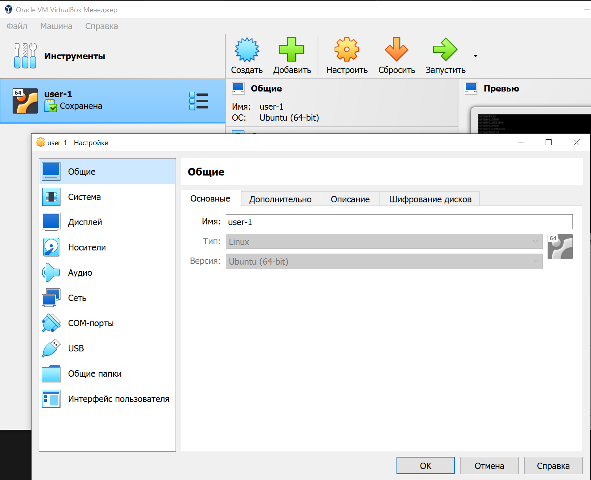
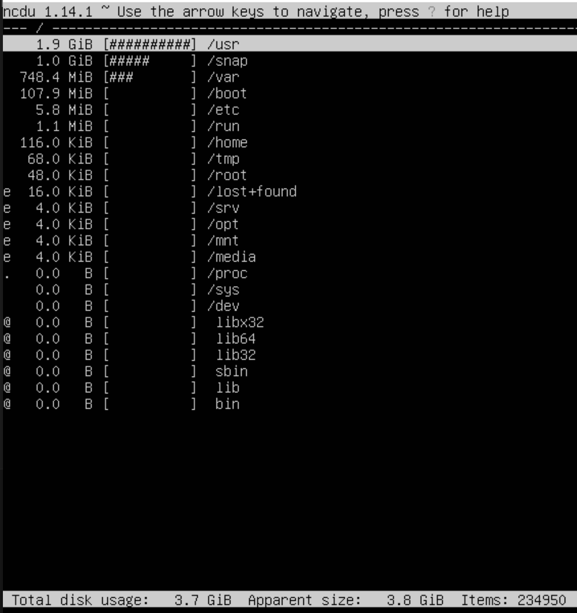

# D01_Linux-1_s21_lemongrb

## Part 1. Установка ОС

* С помощью команды, расположенной ниже, узнаем установленную версию Ubuntu:

  ```
  cat /etc/issue
  ```

  

  *Версия Ubuntu*

## Part 2. Создание пользователя

* Создадим нового пользователя **margo** и добавим его в группу adm:

  ```
  sudo useradd margo -G adm
  ```

  

  *Команда для создания нового пользователя*

  Флаг ``-G`` используется для указания дополнительных групп, в которые должен быть добавлен новый пользователь. В этом случае пользователь margo будет добавлен в группу adm.

   После создания нового пользователя установим пароль для него, используя команду ``sudo passwd margo``, чтобы пользователь мог авторизоваться в системе.

* Выведем на экран нового пользователя:

  ```
  cat /etc/passwd
  ```
  
  

  *Новый пользователь margo*

## Part 3. Настройка сети ОС

* Чтобы задать имя машины **user-1**, необходимо в главном окне списке слева выбрать необходимую машину, нажать пкм->настроить->общие->основные. И в поле "имя" вписать новое имя машины:

  

  *Задаем новое имя машины*

  Изменение имени виртуальной машины не влияет на имя хоста (hostname) внутри самой виртуальной машины. Чтобы изменить имя хоста внутри виртуальной машины Ubuntu, пропишем в консоли:
  ```
  sudo hostname user-1
  ```
  

  *Изменяем имя хоста*


* Для установки временной зоны, соответствующей текущему расположению, необходимо прописать команду:
  ```
  sudo timedatectl set-timezone Europe/Moscow
  ```
  Проверяем изменения с помощью команды:
  ```
  timedatectl
  ```
  

  *Изменяем временную зону на текущую*

* Выводим названия сетевых интерфейсов с помощью команды:
  ```
  ip link
  ```

  

  *Сетевые интерфейсы*

  На сриншоте мы видим наличие **lo** (loopback) интерфейса. Это виртуальный сетевой интерфейс, который используется для тестирования сетевых подключений и протоколов на локальном компьютере. Loopback интерфейс создает виртуальную сетевую среду, в которой все отправленные пакеты данных непосредственно передаются обратно на тот же компьютер, без необходимости физического подключения к сети.

  Loopback интерфейс обычно имеет IP-адрес 127.0.0.1 и маску подсети 255.0.0.0. Этот IP-адрес называется "локальным хостом" или "локальным адресом петли", и он используется для тестирования сетевых приложений и протоколов на локальном компьютере.

  Loopback интерфейс также может использоваться для диагностики сетевых проблем. Например, если приложение не может подключиться к сети, можно попробовать отправить пакеты данных через loopback интерфейс, чтобы проверить, работает ли сетевой стек корректно на локальном компьютере.

  Loopback интерфейс является стандартным компонентом большинства операционных систем и обычно не требует какой-либо специальной настройки или установки драйверов.

* Чтобы получить ip-адрес устройства, на котором происходит работа, от DHCP сервера, необходимо прописать в терминале:
  ```
  sudo dhclient -v
  ```
  Опция ``-v`` означает "verbose" (подробный) режим работы программы dhclient. При использовании этой опции программа выводит дополнительную информацию о процессе получения IP-адреса, включая отправленные и полученные пакеты DHCP, срок действия аренды IP-адреса, параметры конфигурации сети и т.д.
  
  

  *Получение IP-адреса от DHCP*

  DHCP (Dynamic Host Configuration Protocol) - это сетевой протокол, используемый для автоматической настройки параметров TCP/IP устройств в сети. DHCP позволяет устройствам автоматически получать IP-адреса, маски подсети, шлюзы по умолчанию, параметры DNS-серверов и другие настройки сети от DHCP-сервера.

* Внешний ip-адрес шлюза это IP-адрес, который используется для идентификации     сети в Интернете. Этот адрес назначается шлюзу (роутеру) провайдером Интернет-услуг (ISP) и используется для маршрутизации трафика между сетью и Интернетом.

  Чтобы определить внешний ip-адрес шлюза воспользуемся командой:
  ```
  curl ifconfig.me
  ```
  

  *Определяем внешний ip-адрес шлюза*


  Внутренний IP-адрес шлюза - это IP-адрес, который используется для идентификации шлюза внутри локальной сети. Этот адрес назначается шлюзу при его настройке и используется для маршрутизации трафика между устройствами внутри сети и внешним Интернетом.
  Чтобы определить внутренний ip-адрес шлюза воспользуемся командой:
  ```
  ip route | grep default
  ```
  

  *Определяем внутренний ip-адрес шлюза*

* Зададим статичные настройки ip, gw, dns. Для этого перейдем в папку `/etc/netplan` и откроем с помощью nano файл `00-installer-config.yaml`. В этом файле содержится базовая конфигурация сети (настройки IP-адреса, маски подсети, шлюза по умолчанию, DNS-серверов и других параметров сети).

  

  *Открываем файл конфигурации сети*

  Прописываем вручную настройки ip, gw (gateway), dns:

  

  *Статичные настройки ip, gw, dns*

  Для применения изменений используем команду:
  ```
  sudo netplan apply
  ```

* Перезагружаем виртуальную машину и смотрим, сохранились ли изменения ручных настроек. При помощи команды `cat` смотрим содержимое измененного файла `/etc/netplan/00-installer-config.yaml`:

  

  *Изменения, сделанные вручную, сохранены*

* Пропингуем удаленные хосты 1.1.1.1 и ya.ru:
  ```
  ping 1.1.1.1
  ```

  

  *Пропинговали 1.1.1.1, пакеты не потеряны*

  ```
  ping ya.ru
  ```
  

  *Пропинговали ya.ru, пакеты не потеряны*

## Part 4. Обновление ОС
* Чтобы обновить системные пакеты до последней версии, воспользуеся командами:
  ```
  sudo apt update && sudo apt upgrade
  ```
  Первая команда обновляет список доступных пакетов и их версий из репозиториев, настроенных в системе. Это необходимо для того, чтобы система знала, какие пакеты доступны для установки и обновления.

  Вторая команда обновляет установленные пакеты до последних версий, доступных в репозиториях. При этом будут установлены только те пакеты, которые не требуют удаления или установки новых пакетов.

  

  *Обновление системных пакетов выполнено*

## Part 5. Использование команды sudo
* `sudo` (сокращение от "superuser do") - это команда в операционных системах на базе Unix, которая позволяет пользователю выполнять команды с правами администратора (суперпользователя). Команда sudo используется для выполнения задач, требующих повышенных привилегий, таких как установка и удаление программного обеспечения, настройка системы, управление сетью и т.д.

* Разрешаем пользователю **margo** [(см. Part 2)](#part-2-создание-пользователя) выполнять команду sudo:
  ```
  sudo usermod -aG sudo margo
  ```
  Флаг ``-a`` указывает, что пользователь должен быть добавлен в указанную группу sudo, а флаг ``-G`` указывает, что группа sudo должна быть добавлена в список дополнительных групп для пользователя.

  

  *Добавили margo в группу sudo*

  Изменяем текущего пользователя **lemongrb** на **margo**, используя команду:
  ```
  su - margo
  ```
  Команда ``su`` означает "substitute user" (заменить пользователя) и используется для временного переключения на другого пользователя. Опция `-` после команды ``su`` указывает, что необходимо запустить новую оболочку с тем же окружением, что и у пользователя margo.


  Зададим новое hostname ОС на user-5 (было user-1):
  ```
  sudo hostname user-5
  ```

  Проверим изменения с помощью `hostname`:

  
  
  *Пользователь margo меняет hostname ОС*

  Чтобы вернуться к работе от имени пользователя **lemongrb**, воспользуемся командой `exit` для выхода из оболочки пользователя **margo**.

## Part 6. Установка и настройка службы времени

* Для настройки службы автоматической синхронизации времени в Ubuntu воспользуемся `chrony`. Это программа, предназначенная для синхронизации системных часов в операционной системе Linux с точными источниками времени через протокол NTP (Network Time Protocol). Chrony предоставляет более точную синхронизацию времени по сравнению с более простыми средствами, такими как ntpdate.

  Установим **chrony**:
  ```
  sudo apt install chrony
  ```
  При помощи **nano** в файл `/etc/chrony/chrony.conf` добавим сервер времени, с которыми  хотим синхронизироваться, например, ``server time.google.com iburst``.

  После этого запускаем службу chrony и включаем автозапуск службы при загрузке системы:
  ```
  sudo systemctl start chrony    
  sudo systemctl enable chrony
  ```

* Выведем время часового пояса, в котором находимся, используя `timedatectl show`:

  

  *Системное время синхронизировано*

## Part 7. Установка и использование текстовых редакторов

* Для устновки VIM, Nano, Joe на ubuntu пропишем в терминале следующие команды:

  ```
  sudo apt-get update && sudo apt-get install vim
  sudo apt-get update && sudo apt-get install nano
  sudo apt-get update && sudo apt-get install joe
  ```

* Для работы в vim создадим файл **test_vim.txt**:
  ```
  vim test_vim.txt
  ```
  Для перехода в режим **ввода** нажмем на клавишу `i`.

  

  *Содержимое Vim*

  Чтобы сохранить изменения и выйти из Vim, нажмем на клавишу `Esc`, затем пропишем команду `:wq` и нажмем на `Enter`.

* Для работы в Nano создадим файл **test_nano.txt**:

  

  *Содержимое Nano*

  Сохраним изменения и выйдем из nano: `ctrl + s` и `ctrl + x`.

* Для работы в Joe создадим файл **test_joe.txt**:

  

  *Содержимое Joe*

  Сочетание клавиш: `ctrl + k` и `x`, чтобы сохранить содержимое файла и выйти.

* Изменяем содержимое файла в Vim. Входим в режим ввода - `i`.

  

  *Новое содержимое Vim*

  Выходим из режима ввода - `esc`. Вводим в терминале `:q!` + `enter` для выхода без сохранения изменений.

* Изменяем содержимое файла в Nano. 

  

  *Новое содержимое Nano*

  Выходим из программы `ctrl + x` + `n` без сохранения изменений.

* Изменяем содержимое файла в Joe.

  

  *Новое содержимое Joe*

  Выходим из программы `ctrl + с` + `y` без сохранения изменений.

* Снова открываем Vim, отредактируем файл еще раз. После нажимаем на клавишу `/`, вводим слово для поиска и нажимаем `enter`. Чтобы перейти к следующему совпадению, используем клавишу `n`.

  

  *Поиск слова в Vim*

  Для замены слова на другое используем команду `:%s/21/42/g` (`21` - старое слово, `42` - новое слово, `g` - для замены всех встречающихся слов. Чтобы заменить только одно слово - убираем из команды `g`).

  

  *Замена слова в Vim*

* Теперь открываем Nano. Повторяем прошлую замену текста и после ищем слово в строке - `ctr + w` и вводим искомое слово, для перехода к следующему совпдаению - `alt + w`.

  

  *Поиск слова в Nano*

  Для замены слова на другое: `ctrl + \` + искомое слово + `enter`.
  Далее вводим слово, на которое нужно заменить + `enter`. `Y` - для замены одного слова, `A` - для всех.

  

  *Замена слова в Nano*

* В конце работаем с Joe. Меняем содержимое файла, переходим к поиску слова: `ctrl + k` + `f` (find). Далее пишем искомое слово и нажимаем `enter` + `n`.

  

  *Поиск слова в Joe*

  Чтобы заменить слово на другое, используем прошлое сочетание клавиш `ctrl + k` + `f` (find), также прописываем слово, которое собираемся заменить + `enter`. Выбираем клавишу `r` (replace) + `enter`, и вписываем уже само слово для замены + `y` (для одной замены) или `r` (для замены всех слов).

  

  *Замена слова в Joe*

## Part 8. Установка и базовая настройка сервиса SSHD

* SSHD (Secure SHell Daemon) - это служба, которая предоставляет безопасный доступ к удаленному серверу через сеть с использованием протокола SSH (Secure SHell).

  SSHD является серверной частью протокола SSH, которая прослушивает входящие подключения от клиентов SSH и предоставляет им доступ к серверу. При подключении к серверу SSHD проверяет аутентификацию клиента, шифрует данные, передаваемые между клиентом и сервером, и обеспечивает безопасность соединения.

  Служба SSHD используется для удаленного администрирования серверов, передачи файлов, выполнения команд на удаленном сервере и других задач, требующих безопасного доступа к удаленному сервер

  Установим службу SSHd, пропишем в терминал:

  ```
  sudo apt install openssh-server
  ```

  После установки проверим статус служб:

  ```
  systemctl status ssh
  ```

  

  *Служба sshd работает*

  Если служба не была запущена, то прописываем:

  ```
  sudo systemctl start ssh
  ```
* Добавим автостарт службы при загрузке системы: 
  ```
  sudo systemctl enable ssh
  ```

  

  *Включили автостарт sshd*

* По умолчанию sshd слушает порт 22. Перестроим службу на порт 2022:

  Откроем файл конфигурации SSHD с помощью nano и изменим номер порта:

  ```
  sudo nano /etc/ssh/sshd_config
  ```

  

  *Меняем порт на 2022*

  Перезапустим службу SSHD, чтобы изменения вступили в силу:

  ```
  sudo systemctl restart ssh
  ```
  Проверим, изменился ли наш порт:
  ```
  sudo systemctl status ssh
  ```

  

  *Новый 2022 порт*

* Используем команду `ps`, покажем наличие процесса sshd:
  ```
  ps aux | grep sshd
  ```
  

  *Процесс SSHd присутствует*

  `ps aux` - это команда, которая отображает информацию о запущенных процессах в системе. Она показывает идентификатор процесса (PID), имя владельца процесса, используемую память, статус процесса, время запуска процесса и команду, запустившую процесс. Эта команда полезна при диагностике проблем с производительностью, поиске и удалении нежелательных процессов, а также при мониторинге состояния системы.

  Расшифровка опций aux следующая:

  * `a` - отображать информацию о всех процессах, запущенных любыми пользователями (не только текущим пользователем).
  * `u` - отображать информацию о владельце процесса и используемых ресурсах.
  * `x` - отображать информацию о процессах, не имеющих терминала (консоли).
  
  `netstat -tan` - это команда, которая отображает информацию о сетевых подключениях в системе. Она показывает протокол, локальный и удаленный адреса и порты, состояние подключения и идентификатор процесса (PID), который использует это подключение. Эта команда полезна при диагностике проблем с сетью, поиске открытых портов и проверке наличия активных подключений к серверу.

  

  *Вывод команды netstat -tan*

  Опция `-tan` используется для отображения списка всех активных TCP-подключений и слушающих портов.

  Рассмотрим каждый ключ:

  * `t` - отображает только TCP-соединения.
  * `a` - отображает все соединения, включая те, которые находятся в процессе ожидания.
  * `n` - отображает IP-адреса и порты в числовом формате, а не в символьном.

  Вывод команды `netstat -tan` содержит следующую информацию:

  * Протокол (Proto) - тип протокола, используемого для соединения (TCP или UDP).
  * Recv-Q - это количество байтов, которые были получены, но еще не обработаны приложением. Эти данные находятся в буфере приема и ожидают обработки приложением.
  * Send-Q — количество байтов, помещённых в буфер отправки TCP/IP, но не отправленных, или отправленных, но не подтверждённых.
  * Локальный адрес (Local Address) - IP-адрес и номер порта локального хоста.
  * Удаленный адрес (Foreign Address) - IP-адрес и номер порта удаленного хоста.
  * Состояние (State) - текущее состояние TCP-соединения. 

  `0.0.0.0` в поле `local address` обычно означает прослушивание всех интерфейсов для входящих соединений, в то время как в поле `foreign address` указывает на то, что адрес удаленного узла пока не определен или соединение не установлено.


## Part 9. Установка и использование утилит top, htop

  `top` - предоставляет список запущенных процессов и обновляет его через определенные промежутки времени. Интерфейс top является текстовым и немного менее интуитивно понятным, чем у htop.

  

  *Вывод команды top*

  * `uptime` - эта метрика показывает, сколько времени прошло с момента последней перезагрузки системы. На скрине сверху после up указано 1:58 - то есть система работает уже 1 час 58 минут.
  * **Количество авторизованных пользователей** - 1 user.
  * Общая загрузка системы - `load average` указывает, что средняя загрузка системы за последнюю минуту равна 0.02, за последние 5 минут - 0.01, а за последние 15 минут - 0.00.
  * Общее количество процессов `tasks` указывает, что в системе запущено 111 процессов, из которых 1 процесс выполняется в настоящее время, 110 процесса находятся в состоянии ожидания, 0 процессов остановлено и 0 процессов являются зомби-процессами.
  * `%Cpu(s)` показывает процентное использование ЦП всеми процессами в системе в реальном времени. Этот столбец состоит из нескольких подстолбцов, которые показывают:
    * Использование ЦП пользовательскими процессами `(us)`, 
    * Системными процессами `(sy)`, 
    * Процессами с низким приоритетом `(ni)`,
    * `id` (сокращение от "idle") показывает процентное использование ЦП процессами, которые находятся в состоянии ожидания.Cтолбец id показывает значение 100%, это означает, что 100% времени ЦП не используется активными процессами и находится в состоянии ожидания. 
    * Следующие процессы `(wa)`- "I/O wait" (ожидание ввода-вывода). Этот подстолбец показывает процентное использование ЦП, которое тратится на ожидание завершения операций ввода-вывода, таких как чтение или запись на диск. Если вы видите высокое значение в столбце wa, это может означать, что система загружена операциями ввода-вывода и не может обрабатывать их достаточно быстро. Это может быть признаком проблемы с диском, файловой системой или драйверами устройств. 
    * `(hi)` процессы, ожидающие ввода-вывода с высоким приоритетом, 
    * `(si)` "system interrupts" (системные прерывания) процессы, ожидающими ввода-вывода с низким приоритетом. Системные прерывания - это прерывания, вызванные внешними устройствами, такими как клавиатура, мышь или сетевая карта. Эти прерывания обрабатываются ядром системы и могут занять некоторое время ЦП. Если вы видите высокое значение в столбце si, это может означать, что система загружена системными прерываниями, и это может быть признаком проблемы с внешним устройством или драйвером устройства. 
    * `st` "steal time" (время украденное). Этот подстолбец показывает процентное использование ЦП, которое было украдено у виртуальной машины или контейнера. "Украденное время" - это время, которое ЦП проводит в ожидании ресурсов, которые недоступны из-за ограничений виртуализации. Это может происходить, когда несколько виртуальных машин или контейнеров конкурируют за ресурсы одного физического ЦП. Если вы видите высокое значение в столбце st, это может означать, что виртуальная машина или контейнер не получает достаточно ресурсов ЦП, и это может быть признаком проблемы с настройкой виртуализации.
  * Загрузка памяти отображается в нескольких столбцах, которые предоставляют информацию о использовании физической и виртуальной памяти.
    * Столбец `%Mem` показывает процентное использование физической памяти всеми процессами в системе. Этот столбец состоит из нескольких подстолбцов, которые показывают использование памяти различными типами процессов.
      * total: Общее количество памяти, доступное в системе (4832.7).
      * used: Общее количество используемой памяти. Это включает в себя память, используемую приложениями, ядром и кэшем (3987.3).
      * free: Общее количество свободной памяти, которая не используется приложениями, ядром или кэшем (174.2).
      * buff/cache: Общее количество памяти, используемое буферами и кэшем. Это память, которая используется для кэширования файлов и других данных, чтобы ускорить доступ к ним в будущем (671.2).
    * Столбец `%Swap` показывает процентное использование виртуальной памяти (файла подкачки) всеми процессами в системе. Этот столбец также состоит из нескольких подстолбцов, которые показывают использование виртуальной памяти различными типами процессов.
      * available: Общее количество памяти, которое может быть немедленно использовано приложениями без необходимости освобождения буферов или кэша (4425.2).
  * pid процесса занимающего больше всего памяти - нажимаем  `%MEM` - `shift + m`. PID - **708**.

    

    *708 pid*

  * pid процесса, занимающего больше всего процессорного времени `%CPU` - `shift + p`. PID - **2119**.

    

    *2119 pid*


* `htop` - это более современная альтернатива top, которая предоставляет более визуальный и интуитивно понятный интерфейс. Она использует графические элементы, такие как горизонтальные и вертикальные индикаторы, для отображения использования ресурсов системы. htop также предоставляет более гибкие возможности для сортировки и фильтрации процессов, а также позволяет выполнять некоторые базовые операции управления процессами, такие как изменение приоритета или убийство процесса, непосредственно из интерфейса.

  Выведем содержимое команды `htop`:

  

    *Вывод команды htop*
  
* Выводы команды htop, отсортированные по (F6 + стрелочки):
  * PID:
    

    *Отсортированный pid*

  * PERCENT_CPU:
    

    *Отсортированный percent_cpu*
  * PERCENT_MEM:
    

    *Отсортированный percent_mem*
  * TIME:
    

    *Отсортированный time*

* Чтобы отфильтровать вывод команды htop для процесса sshd, нажмем `F4` + напишем в поле сверху `sshd`.
  

    *Фильтрация по sshd*

* Отфильтруем вывод htop с помощью поиска и процессом syslog (`F3` + `syslog`):
  

    *Поиск syslog*
* Сделаем вывод htop с добавленными hostname, clock и uptime. Для этого нажмем `F2` + и с помощью стрелочек и enter добавляем их в left и right column.
  

    *Добавляем в колонки Hostname, Clock, Uptime в Setup*

    

    *Hostname, Clock, Uptime в Setup в главном выводе htop*

## Part 10. Использование утилиты fdisk

* Запустим команду:
  ```
  sudo fdisk -l
  ```
  Команда fdisk -l используется для отображения списка всех разделов на всех жестких дисках в системе.

  Флаг -l (или --list) в этой команде означает, что fdisk должен выводить список разделов на всех жестких дисках, а не запускать интерактивный режим для редактирования таблицы разделов.

  

  *Вывод команды fdisk -l*

  * Название жесткого диска - **/dev/sda**.
  * Размер жесткого диска - **25 Gib** или **26843545600 bytes**.
  * Количество секторов - **52428800**. Сектор - это минимальная единица адресации информации на жестком диске, которая обычно равна 512 байтам.
  * **Swap** (также называемый swap-пространство, swap-файл или swap-раздел) - это область на жестком диске, которая используется операционной системой в качестве временного хранилища для данных, которые не могут быть размещены в физической памяти (RAM).

    Когда системе не хватает физической памяти для выполнения всех запущенных процессов, она может временно перемещать неиспользуемые или наименее важные данные из памяти в swap-пространство на жестком диске. Это позволяет освободить память для более важных процессов и предотвратить зависание или сбой системы.

    Swap-пространство обычно используется в качестве "резервного" хранилища памяти, когда физическая память исчерпана. Однако swap-пространство медленнее, чем физическая память, потому что жесткий диск имеет более низкую скорость чтения/записи, чем RAM. Поэтому избыточное использование swap-пространства может привести к замедлению системы.
    Чтобы посмотреть размер swap воспользуемся командой:
    ```
    free -h
    ```
    Размер swap - 0 b.

    

    *Размер swap*

    Команда `free` в Linux и Unix-подобных операционных системах используется для отображения информации о использовании памяти. Она показывает количество использованной и свободной памяти, а также количество памяти, используемой кэшем и буферами. `-h` означает "human-readable".

## Part 11. Использование утилиты df

* Команда `df` (от англ. disk free) в Linux и Unix-подобных операционных системах используется для отображения информации о использовании дискового пространства. Она показывает количество использованного и свободного места на всех смонтированных файловых системах, включая разделы жесткого диска, USB-накопители, сетевые диски и другие устройства хранения данных:

  

    *Вывод команды df*

  * Информация по корневому разделу `/dev/mapper/ubuntu--vg-ubuntu--lv`:
    * размер раздела - 11758760 kb;
    * размер занятого пространства - 2757448 kb;
    * размер свободного пространства - 8382204 kb;
    * процент использования - 25%;
    * единица измерения - килобайт.

* Флаг `-Th` в команде `df` используется для отображения типа файловой системы и размера разделов в человекочитаемом формате.

  Флаг `-T` дополнительно отображает тип файловой системы для каждого раздела (ext4, ntfs, swap). Флаг `-h` отображает размеры разделов в человекочитаемом формате, например, в килобайтах, мегабайтах, гигабайтах.

  

    *Вывод команды df -Th*
  
  * Информация по корневому разделу `/dev/mapper/ubuntu--vg-ubuntu--lv`:
    * размер раздела - 12 G;
    * размер занятого пространства - 2.7 G;
    * размер свободного пространства - 8.0 kb;
    * процент использования - 25%;
    * единица измерения - гигабайт;
    * тип файловой системы для раздела - ext4.

    Файловая система - это способ организации и хранения файлов на носителе информации, таком как жесткий диск, твердотельный накопитель (SSD), флеш-накопитель или оптический диск.

    `Ext4` - (сокращение от четвертой расширенной файловой системы) - это файловая система с журналированием метаданных и данных. Она предоставляет множество улучшений по сравнению с Ext3, включая увеличенный предел размера файла и файловой системы, более быструю производительность, поддержку расширенных атрибутов, поддержку журналирования метаданных и данных, а также более эффективное использование пространства на диске.

    `Ext4` использует журнал для отслеживания изменений в файловой системе, что позволяет быстро восстанавливать файловую систему после неожиданного отключения питания или сбоя системы. Журнал метаданных позволяет Ext4 гарантировать целостность файловой системы, а журнал данных позволяет гарантировать целостность данных при записи на диск.

    `Ext4` также поддерживает различные функции оптимизации производительности, такие как выделение блоков данных заранее (preallocation) и отложенная запись (delayed allocation), которые помогают уменьшить фрагментацию и увеличить скорость чтения и записи.

## Part 12. Использование утилиты du

Команда `du` (disk usage) выводит размер всех папок в каталоге. Параметр `-s` показывает только общий размер каждой папки. `-h` покажет размер каждой папки в человекочитаемом формате. Флаг `-b` выведет размер каждой папки в байтах.

* Выведем размер папок **/home** в:
  * байтах с помощью команды `sudo du -sb /home/`:

    

    *Вывод команды в байтах*

  * человекочитаемом виде с помощью команды `sudo du -sh /home/`:

    

    *Вывод команды в человекочитаемом виде*

* Выведем размер папок **/var** в:

  * байтах с помощью команды `sudo du -sb /var/`:

    

    *Вывод команды в байтах*

  * человекочитаемом виде с помощью команды `sudo du -sh /var/`:

    

    *Вывод команды в человекочитаемом виде*

* Выведем размер папок **/var/log** в:

  * байтах с помощью команды `sudo du -sb /var/log/`:

    

    *Вывод команды в байтах*

  * человекочитаемом виде с помощью команды `sudo du -sh /var/log/`:

    

    *Вывод команды в человекочитаемом виде*

* Выведем размер всего содержимого, каждого вложенного элемента **/var/log**:
  * в человекочитаемом виде с помощью команды `sudo du -sh /var/log/*`:

    

    *Вывод команды в человекочитаемом виде*

## Part 13. Установка и использование утилиты ncdu

`ncdu` (ncurses disk usage) - это утилита с графическим интерфейсом, основанная на библиотеке ncurses. ncdu предоставляет более наглядное представление использования дискового пространства, показывая размеры файлов и папок в виде дерева каталогов. ncdu также позволяет просматривать содержимое каталогов и удалять файлы и папки непосредственно из интерфейса утилиты. ncdu может работать как локально, так и удаленно через SSH.

* Установим ncdu с помощью команды `sudo apt install ncdu`.
  Выведем размер папок **/home** и **/var** с помощью команды `sudo ncdu /`:

  

    *Вывод команды ncdu*
  
  * размер папки `/home` - 116 килобайт;
  * размер папки `/var` - 748.4 мегабайт;
  * размер папки `/var/log` - 83.6 мегабайт.

  

  *Вывод команды sudo ncdu /var/*

## Part 14. Работа с системными журналами

* Файл **/var/log/dmesg** содержит информацию о состоянии оборудования, ошибках драйверов, сообщениях об ошибках ядра и других событиях, связанных с ядром и устройствами. Эта информация может быть полезна для диагностики проблем с оборудованием и программным обеспечением, а также для отладки драйверов и ядра.

  `less` - это утилита командной строки в Linux и других Unix-подобных системах, которая используется для просмотра содержимого файлов и вывода команд по страницам. Утилита less позволяет просматривать файлы без необходимости их полного открытия, что может быть полезно при работе с большими файлами.

  

    *Вывод команды less /var/log/dmesg*

* Файл **/var/log/syslog** содержит информацию о работе системных служб, таких как сетевые службы, службы аутентификации, службы журналов и т.д. Эта информация может быть полезна для диагностики проблем с системой, а также для мониторинга ее работы.

  

    *Вывод команды less /var/log/syslog*

* Файл **/var/log/auth.log** обычно содержит информацию о работе служб аутентификации, таких как PAM (Pluggable Authentication Modules), SSH (Secure Shell), sudo (суперпользователь до), и т.д. Эта информация может быть полезна для диагностики проблем с аутентификацией, а также для обнаружения попыток несанкционированного доступа к системе.

 

  *Вывод команды less /var/log/auth.log*

* На скрине выше мы можем наблюдать:
  * время последней успешной авторизации - 17 марта 20:29:27;
  * имя пользователя - lemongrb;
  * метод входа в систему - by LOGIN(uid=0).

  При входе в систему с помощью команды `LOGIN` пользователю предлагается ввести имя пользователя и пароль для аутентификации. После успешной аутентификации пользователь получает доступ к системе с правами, соответствующими его учетной записи. Если пользователь вошел в систему с UID (идентификатор пользователя) равным 0, он получит полный доступ ко всем ресурсам системы - пользователю root (суперпользователь). Пользователь root имеет наивысшие привилегии в системе и может выполнять любые операции без ограничений.
  
* Перезапускаем службу **sshd** с помощью `sudo systemctl restart sshd`.
* Заходим в /var/log/auth.log с командой `less` и видим сообщение о рестарте службы:

  

  *Сообщение о рестарте sshd*

## Part 15. Использование планировщика заданий CRON

`cron` - это утилита для планирования задач в Unix-подобных операционных системах. Аббревиатура cron происходит от греческого слова "chronos", которое означает "время".

Утилита cron используется для запуска команд или скриптов в определенное время или через определенные промежутки времени. Файл конфигурации cron называется "crontab" (сокращение от "cron table"). Команда `crontab -e` используется для редактирования файла crontab текущего пользователя. Опция -e означает "edit" (редактировать).

* Откроем файл crontab с помощью nano (`sudo nano crontab -e`) и отредактируем его - запустим команду uptime через каждые 2 минуты, результат команды запишем в **/var/log/uptime.log**:

  

  *Редактируем crontab*

  Выражение `*/2 * * * *` означает, что задача должна выполняться каждые 2 минуты.

* Посмотрим содержимое файла **/var/log/uptime.log** с помощью less:

  

  *Вывод uptime каждые 2 минуты*

* Выведем список текущих заданий для CRON `sudo crontab -l` (list):

  

  *Текущие задачи для CRON*

* Удалим все задания из CRON `sudo crontab -r` (remove):

  

  *Удалили все задачи для CRON*